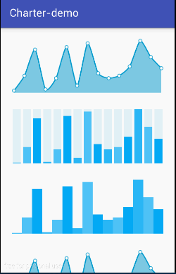
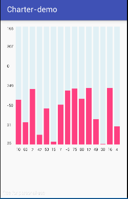
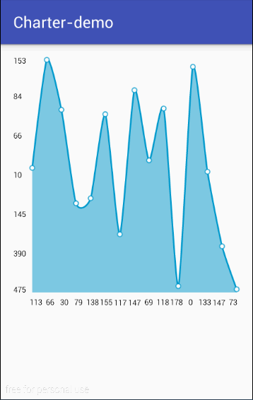

Charter
=====
  
  
  
```
下面三幅图是我在原作者的基础上添加的。  

提交的代码中给出了大部分的注释，读者可以轻松的看出代码的功能。  

不得不说，大牛的代码读起来真的是一种享受！！  
学到不少东西！！你值得拥有！
```

为自己做个广告（^_^）：
欢迎关注[我的github](https://github.com/longyinzaitian)！  
欢迎关注[我的博客](http://blog.csdn.net/u010156024)！  

##Importing to your project
Add this dependency to your build.gradle file:
```java
dependencies {
    compile 'com.hrules:charter:1.2.0'
}
```

Developed by
-------
Héctor de Isidro - hrules6872 [](http://twitter.com/h_rules)

License
-------
    Copyright 2015 Héctor de Isidro - hrules6872

    Licensed under the Apache License, Version 2.0 (the "License");
    you may not use this file except in compliance with the License.
    You may obtain a copy of the License at

       http://www.apache.org/licenses/LICENSE-2.0

    Unless required by applicable law or agreed to in writing, software
    distributed under the License is distributed on an "AS IS" BASIS,
    WITHOUT WARRANTIES OR CONDITIONS OF ANY KIND, either express or implied.
    See the License for the specific language governing permissions and
    limitations under the License.
